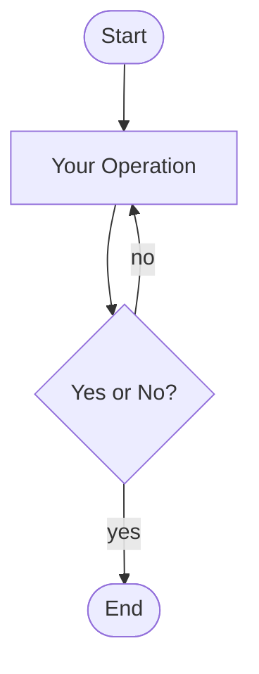

# Lorem ipsum

## 1. Lorem ipsum dolor sit amet

Lorem **ipsum** dolor sit *amet*, consectetur ***adipiscing*** elit. ~~Mauris non sagittis quam~~. Fusce a ante eu ==velit bibendum== blandit a <u>non lectus</u>.

### 1.1 Duis quis sapien

Duis quis sapien eget nisl fermentum vestibulum a id arcu. Sed a lorem dapibus, lacinia sem vitae, pulvinar nulla. Mauris quis hendrerit metus. Vestibulum sit amet lectus ac neque finibus finibus non nec sem.

> Aenean maximus blandit lectus, et commodo dolor accumsan vel. Aenean feugiat erat turpis, ut semper nisl semper ut. Sed in enim vulputate, suscipit est vel, fermentum lectus.

### 1.2 Nunc pellentesque ullamcorper

Nunc pellentesque ullamcorper metus et tempor. `Mauris` non blandit turpis, in `iaculis libero`.

```python
>>> def foo(x):
...     return x + 1
...
>>> foo(3)
4
```

$$
f(x) \ne \sum_{n=1}^{N} (n^3 + k)
$$

### 1.3 Vestibulum vitae dolor sit amet

| Ullamcorper | placerat | nibh |
| --- | --- | --- |
| nulla | nec | velit |
| consectetur | quis | dolor |

Vestibulum vitae dolor sit amet erat malesuada sagittis.[^1][^2]

[^1]: [Etiam vel hendrerit mi](#)
[^2]: https://www.google.com

## 2. In id fermentum augue

In id fermentum augue. Donec tristique hendrerit quam a convallis.

- Nulla facilisi.
- Praesent at rhoncus sem.
  - Sed ultricies,
    - velit justo condimentum nulla,
  - in imperdiet velit odio sed nisi.
- Proin eget imperdiet sem.

> Donec ante odio, posuere tristique dui vel, aliquam dignissim quam. Aliquam laoreet posuere pellentesque. Quisque eu purus dictum, consequat metus id, varius eros. Proin tempor metus est, at consequat nisi congue at.

1. Vivamus dolor mauris,
2. molestie a sagittis quis,
3. facilisis quis ex.

- [x] In metus nisl,
- [x] ~~consectetur in leo vitae,~~
- [x] tristique fringilla sem.
- [ ] Mauris quis lacus et ipsum dignissim auctor.

## 3. Quisque eu purus dictum

Duis imperdiet odio ante, sit amet condimentum dolor rhoncus in. Etiam ac arcu non arcu interdum faucibus. Curabitur ut auctor risus. Quisque pharetra, purus id ornare vestibulum, nulla urna consequat ipsum, sed tempor nisl sapien et nulla.



Vestibulum ante ipsum primis in faucibus orci luctus et ultrices posuere cubilia curae; Sed fringilla odio sapien, egestas pretium sapien vehicula non.
